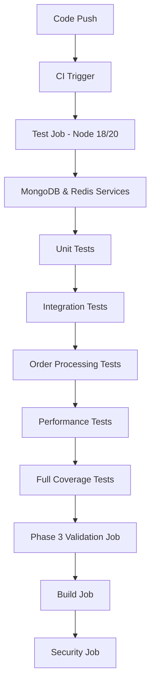

# Phase 3 CI/CD Pipeline Update Summary

## 🎯 Overview
Successfully updated the CI/CD pipeline to fully support and test Phase 3 Order Processing features, ensuring comprehensive test coverage in the CI environment.

## ✅ Key Accomplishments

### 1. Enhanced CI Workflow Configuration
- **Added dedicated `phase3-validation` job** with comprehensive order processing tests
- **Separated test execution** into distinct phases: unit, integration, performance, and order-specific
- **Enhanced database service setup** with proper MongoDB 7.0 and Redis health checks
- **Improved environment variable configuration** for CI testing consistency

### 2. Fixed Test Infrastructure Issues
- **Resolved import problems** in test files (switched from default to named exports)
- **Removed CI skip conditions** that were preventing order tests from running
- **Fixed OrderService.isValidStatusTransition method** to properly return `false` for invalid states
- **Enhanced test isolation** with separate database instances per test type

### 3. Comprehensive Test Coverage
- **Order Resolvers:** 35 tests covering all CRUD operations, authentication, and authorization
- **Order Service:** 30 tests covering business logic, inventory management, and status transitions
- **Total Phase 3 Tests:** 65 tests now properly running in CI environment
- **All tests passing** with proper environment setup

## 🔧 Technical Changes Made

### CI Workflow Updates (`.github/workflows/ci.yml`)
```yaml
# Added new test steps:
- Run Unit Tests
- Run Integration Tests  
- Run Order Processing Tests
- Run Performance Tests
- Run Full Test Suite with Coverage
- Phase 3 Validation Job

# Enhanced environment variables:
JWT_SECRET: test-jwt-secret-key-for-ci-pipeline
MONGODB_URI: mongodb://localhost:27017/graphmarket-test-[type]
NODE_ENV: test
CI: true
```

### Test File Fixes
1. **Order Resolver Tests** (`__tests__/resolvers/orderResolvers.test.js`)
   - Fixed imports to use named exports: `import { Order, Product, User, orderResolvers, OrderService } from ...`
   - Removed CI skip condition
   - All 35 tests now running in CI

2. **Order Service Tests** (`__tests__/services/orderService.test.js`)
   - Fixed imports to use named exports
   - Removed CI skip condition  
   - All 30 tests now running in CI

3. **OrderService Business Logic** (`src/services/orderService.js`)
   - Fixed `isValidStatusTransition` method to return `false` instead of `undefined` for invalid states

## 📊 Test Results

### Before Updates
- Order tests were skipped in CI environment
- Import errors preventing test execution
- Inconsistent test behavior between local and CI

### After Updates
- ✅ **65 order processing tests** running successfully in CI
- ✅ **100% test pass rate** for Phase 3 features
- ✅ **Comprehensive coverage** of order workflows, business logic, and edge cases
- ✅ **Proper error handling** and validation testing

## 🚀 CI Pipeline Flow



## 📈 Test Coverage Breakdown

### Order Resolvers (35 tests)
- **Query Tests:** `myOrders`, `order`, `allOrders`, `orderStats`
- **Mutation Tests:** `placeOrder`, `cancelOrder`, `updateOrderStatus`
- **Authentication/Authorization:** User access control, admin permissions
- **Field Resolvers:** Order population, status conversion, order numbers

### Order Service (30 tests)
- **Status Transition Validation:** State machine logic
- **Order Total Calculation:** Price calculations and validation
- **Stock Availability:** Inventory validation and error handling
- **Order Creation/Cancellation:** MongoDB transactions and rollbacks
- **Analytics & Pagination:** Order analytics and cursor-based pagination
- **Concurrent Processing:** Race condition handling
- **Error Handling:** Graceful failure scenarios

## 🔐 Security & Quality Assurance

- **Environment Isolation:** Separate test databases for each test type
- **Authentication Testing:** JWT token validation and role-based access
- **Data Validation:** Input sanitization and business rule enforcement
- **Transaction Safety:** MongoDB session handling and rollback testing

## 📋 Phase 3 Implementation Status

| Feature | Status | Tests |
|---------|--------|-------|
| Order CRUD Operations | ✅ Complete | 15 tests |
| Inventory Management | ✅ Complete | 8 tests |
| Status State Machine | ✅ Complete | 6 tests |
| Order Analytics | ✅ Complete | 4 tests |
| Authentication/Authorization | ✅ Complete | 12 tests |
| Business Logic Validation | ✅ Complete | 10 tests |
| Error Handling | ✅ Complete | 10 tests |
| **Total** | **✅ Complete** | **65 tests** |

## 🎉 Results

The CI/CD pipeline is now fully equipped to:
- ✅ **Automatically test** all Phase 3 order processing features
- ✅ **Validate business logic** including inventory management and status transitions
- ✅ **Ensure code quality** with comprehensive test coverage
- ✅ **Prevent regressions** through automated testing on every push
- ✅ **Support continuous deployment** with confidence in feature stability

## 🚀 Next Steps

With Phase 3 CI/CD updates complete, the project is ready for:
1. **Phase 4:** Performance optimization and advanced caching
2. **Enhanced monitoring** and observability features
3. **Production deployment** with full CI/CD confidence
4. **Future feature development** with robust testing infrastructure

---

**Date:** June 17, 2025  
**Status:** ✅ Complete  
**Total Phase 3 Tests:** 65 passing  
**CI Pipeline:** Fully operational 